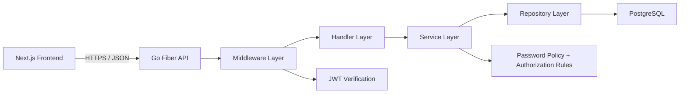

# Pomo Smart Task

Pomo Smart Task is a full-stack task management system with Pomodoro support, JWT-based authentication, and role-based authorization. The system is built without using end-to-end authentication services and implements custom login, password hashing, JWT verification, and backend permission checks.

## Tech Stack

### Frontend
- Next.js 16 (App Router)
- React 19 + TypeScript
- Tailwind CSS + shadcn/ui
- TanStack Query
- Zustand
- Axios

### Backend
- Go
- Fiber v3
- GORM
- PostgreSQL
- JWT
- bcrypt

## System Architecture

The system uses a layered architecture:

- `frontend` handles UI, role-based navigation, and API requests
- `backend/handler` receives HTTP requests and returns JSON responses
- `backend/service` contains business rules such as login, password policy, reports, and role updates
- `backend/repository` handles database access through GORM
- PostgreSQL stores users, tasks, tags, refresh tokens, and audit logs



## Authentication Flow

This project uses a custom authentication flow.

1. A user registers with `email`, `username`, and `password`.
2. The backend validates the password policy and hashes the password with `bcrypt`.
3. A user logs in with email and password.
4. The backend verifies the password hash and returns:
   - `accessToken` in JSON response
   - `refresh_token` in `HttpOnly` cookie
5. The frontend stores the access token in state and sends it in the `Authorization: Bearer <token>` header.
6. Every protected backend route passes through `JWTMiddleware`.
7. If the access token expires, the frontend calls `/auth/refresh`.
8. The backend validates the refresh token, checks revocation state, and issues a new access token.
9. If the token is invalid, expired, revoked, or has the wrong type, the backend returns `401 Unauthorized`.

## Authorization Design

The system uses JWT claims plus backend permission checks. Role checks are not trusted from the frontend alone.

### Roles

- `member`
- `staff`
- `admin`

### Role Journey

- `member` lands on personal productivity pages: dashboard, tasks, pomodoro, and personal reports
- `staff` lands on staff workspace pages and team reports
- `admin` lands on admin workspace pages, system reports, audit logs, and user management

### Backend Authorization

- All protected routes are grouped under `JWTMiddleware`
- JWT signature and token type are verified by the backend
- Permissions are checked by `RequirePermission`
- Database access is restricted by role-specific queries

### Permission Matrix

| Feature | Member | Staff | Admin |
| --- | --- | --- | --- |
| Manage own tasks | Yes | No | No |
| View own reports | Yes | No | No |
| View team reports | No | Yes | Yes |
| View system reports | No | No | Yes |
| View all users | No | Yes | Yes |
| Update user role | No | No | Yes |
| Deactivate user accounts | No | No | Yes |
| View audit logs | No | No | Yes |

### Database Access Control

- Same table, different permission:
  - `member` reads only their own tasks with `WHERE user_id = ?`
  - `staff` and `admin` can view team/system summaries using all-task queries
- Different table by role:
  - only `admin` can access audit logs from the `audit_logs` table

## Security Measures (OWASP Mapping)

| Area | Implementation | OWASP Mapping |
| --- | --- | --- |
| Password hashing | Passwords are hashed with `bcrypt` only | OWASP Password Storage Cheat Sheet |
| Salt | Salt is automatic through bcrypt | OWASP Password Storage Cheat Sheet |
| No plaintext password | Passwords are never stored or returned in plaintext | OWASP Password Storage Cheat Sheet |
| Password policy | New passwords require minimum length, common-password blocking, and bcrypt byte-limit protection | OWASP Authentication Cheat Sheet |
| JWT verification | Backend verifies JWT signature, token type, and expiration on protected requests | OWASP Authentication Cheat Sheet |
| Backend role enforcement | Role and permission checks are enforced in backend middleware | OWASP Authorization guidance |
| HTTPS enforcement | Production rejects non-HTTPS requests and frontend disallows insecure backend URLs outside localhost | OWASP Transport Layer Protection |
| Secret management | JWT secret and OAuth client secret are loaded from environment variables, not hardcoded in source code | OWASP Secrets Management |
| SQL Injection prevention | GORM parameterized queries are used instead of string-built SQL | OWASP SQL Injection Prevention Cheat Sheet |
| XSS prevention | React escapes rendered values by default and the app does not render user-provided HTML | OWASP XSS Prevention Cheat Sheet |

## Important Security Notes

- The system does not use a full end-to-end authentication service such as Firebase Auth
- Passwords are not stored in plaintext
- JWT is verified by the backend, not only by the frontend
- Secrets are read from environment variables
- Role checks on the frontend are only for UX; actual authorization is enforced by the backend

## Project Structure

```txt
Pomo-smart-task/
  backend/
    cmd/api/               # API entry point
    internal/
      auth/                # OAuth helper
      config/              # app and security config
      handler/             # HTTP handlers
      middleware/          # JWT, permissions, HTTPS
      model/               # database models
      permission/          # permission map
      repository/          # database access
      routes/              # route registration
      service/             # business logic
    config/db/             # DB setup

  frontend/
    src/app/               # pages and role layouts
    src/components/        # shared UI
    src/features/          # auth, dashboard, admin, staff, reports
    src/store/             # auth store
```

## Run Locally

### Backend

Create `backend/.env`:

```env
DATABASE_URL=postgresql://<user>:<password>@<host>/<db>?sslmode=require
PORT=8080
JWT_SECRET=your-strong-secret-at-least-32-characters
GOOGLE_CLIENT_ID=your-google-client-id
GOOGLE_CLIENT_SECRET=your-google-client-secret
GOOGLE_REDIRECT_URL=http://localhost:8080/api/v1/auth/google/callback
FRONTEND=http://localhost:3000
APP_ENV=local
```

Run:

```bash
go mod tidy
go run ./cmd/api
```

### Frontend

Create `frontend/.env.local`:

```env
NEXT_PUBLIC_BACKEND_URL=http://localhost:8080/api/v1
```

Run:

```bash
npm install
npm run dev
```

Open `http://localhost:3000`
