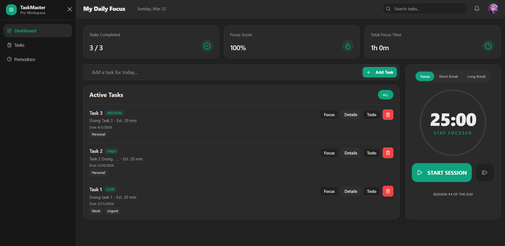
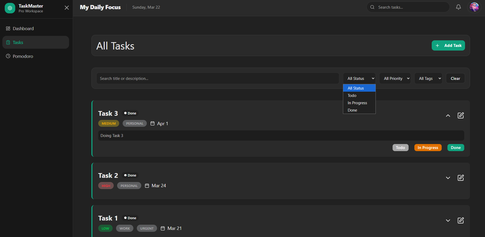
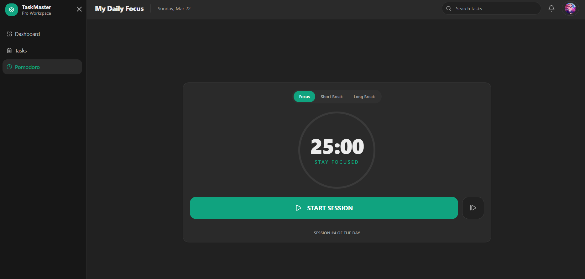
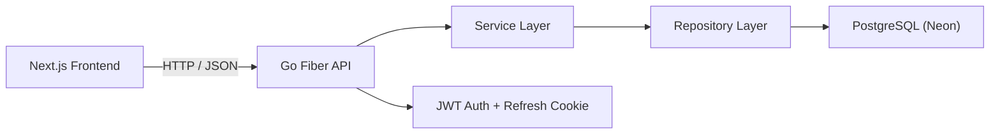

# Pomo Smart Task

Pomo Smart Task is a full-stack task management app with Pomodoro support.
It helps users plan tasks, track progress, and stay focused during work sessions.

This project has:
- `backend` (Go + Fiber + GORM + PostgreSQL)
- `frontend` (Next.js + React + shadcn/ui)

## What This System Does
- User registration and login
- Task CRUD (create, read, update, delete)
- Dashboard summary (completed tasks, focus score, focus time)
- Pomodoro timer connected to selected tasks
- JWT auth with access token + refresh token (refresh token via cookie)

## Tech Stack

### Frontend
- Next.js 16 (App Router)
- React 19 + TypeScript
- Tailwind CSS + shadcn/ui
- TanStack Query (React Query)
- Zustand
- Axios

### Backend
- Go
- Fiber v3
- GORM
- PostgreSQL (Neon)
- JWT

## Project Structure
```txt
Pomo-smart-task/
  backend/
    cmd/api/               # API entry point
    internal/
      handler/             # HTTP handlers
      service/             # business logic
      repository/          # database access
      routes/              # route registration
      middleware/          # auth/jwt middleware
      model/               # database models
    config/db/             # DB connection and migrations

  frontend/
    src/app/               # Next.js pages/layouts
    src/features/          # feature modules (auth, dashboard, tasks)
    src/components/        # shared UI components
    src/lib/               # providers and shared utilities
```

## Auth Token Flow (Simple)
1. User logs in.
2. Backend returns an `accessToken` and sets `refresh_token` cookie.
3. Frontend uses `accessToken` for protected API calls.
4. When access token expires, frontend calls `/auth/refresh`.
5. If refresh token is invalid/expired, user must log in again.

## Run Locally

### 1) Start Backend
Go to `backend` and create `.env`:

```env
DATABASE_URL=postgresql://<user>:<password>@<host>/<db>?sslmode=require
PORT=8080
JWT_SECRET=your-secret
CORS_ALLOWED_ORIGINS=http://localhost:3000
```

Run:
```bash
go mod tidy
go run ./cmd/api
```

### 2) Start Frontend
Go to `frontend` and create `.env.local`:

```env
NEXT_PUBLIC_API_URL=http://localhost:8080/api/v1
```

Run:
```bash
npm install
npm run dev
```

Open: `http://localhost:3000`

## Screenshots




## Architecture
Simple flow:



## Roles And Permissions

This project uses 3 roles:
- `member`
- `staff`
- `admin`

### Member
- Manage their own tasks
- View their own tags
- View their own reports
- View their own activity
- Manage their own login session
- Cannot view other users
- Cannot access team or system reports
- Cannot view audit logs

### Staff
- Everything a `member` can do
- View all users in a basic user list
- View team-level reports
- View user activity for operational work
- Can help monitor usage and productivity
- Cannot change admin roles
- Cannot revoke any session
- Cannot view full system audit logs

### Admin
- Everything a `staff` can do
- View full audit logs
- View system-wide reports
- Update user roles
- Revoke user sessions
- View all users and manage account access
- Deactivate user accounts
- Monitor security-related activity

### Notes
- `admin` should not be treated as "can do everything"
- audit logs should be readable by admin, but not editable or deletable from the app
- role checks are mapped to permissions in backend, so routes do not need to hardcode role names everywhere

### Current Permission Set
- `task.read_own`
- `task.write_own`
- `tag.read_own`
- `activity.read_own`
- `activity.read_all`
- `report.read_own`
- `report.read_team`
- `report.read_all`
- `user.read_own`
- `user.read_all`
- `user.role_update`
- `session.revoke`
- `audit.read`

## Role Matrix

| Feature | Member | Staff | Admin |
|---|---|---|---|
| Manage own tasks | Yes | Yes | Yes |
| View own reports | Yes | Yes | Yes |
| View team reports | No | Yes | Yes |
| View system reports | No | No | Yes |
| View own activity | Yes | Yes | Yes |
| View all user activity | No | Yes | Yes |
| View all users | No | Yes | Yes |
| Update user role | No | No | Yes |
| Revoke user session | No | No | Yes |
| View audit logs | No | No | Yes |
| Deactivate user accounts | No | No | Yes |
