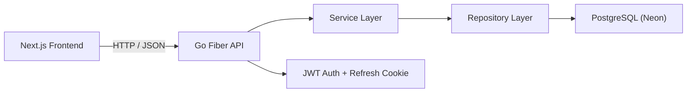

# Pomo Smart Task

Pomo Smart Task is a full-stack task management app with Pomodoro support.
It helps users plan tasks, track progress, and stay focused during work sessions.

This project has:
- `backend` (Go + Fiber + GORM + PostgreSQL)
- `frontend` (Next.js + React + shadcn/ui)

## What This System Does
- User registration and login
- Task CRUD (create, read, update, delete)
- Dashboard summary (completed tasks, focus score, focus time)
- Pomodoro timer connected to selected tasks
- JWT auth with access token + refresh token (refresh token via cookie)

## Tech Stack

### Frontend
- Next.js 16 (App Router)
- React 19 + TypeScript
- Tailwind CSS + shadcn/ui
- TanStack Query (React Query)
- Zustand
- Axios

### Backend
- Go
- Fiber v3
- GORM
- PostgreSQL (Neon)
- JWT

## Project Structure
```txt
Pomo-smart-task/
  backend/
    cmd/api/               # API entry point
    internal/
      handler/             # HTTP handlers
      service/             # business logic
      repository/          # database access
      routes/              # route registration
      middleware/          # auth/jwt middleware
      model/               # database models
    config/db/             # DB connection and migrations

  frontend/
    src/app/               # Next.js pages/layouts
    src/features/          # feature modules (auth, dashboard, tasks)
    src/components/        # shared UI components
    src/lib/               # providers and shared utilities
```

## Auth Token Flow (Simple)
1. User logs in.
2. Backend returns an `accessToken` and sets `refresh_token` cookie.
3. Frontend uses `accessToken` for protected API calls.
4. When access token expires, frontend calls `/auth/refresh`.
5. If refresh token is invalid/expired, user must log in again.

## Run Locally

### 1) Start Backend
Go to `backend` and create `.env`:

```env
DATABASE_URL=postgresql://<user>:<password>@<host>/<db>?sslmode=require
PORT=8080
JWT_SECRET=your-secret
CORS_ALLOWED_ORIGINS=http://localhost:3000
```

Run:
```bash
go mod tidy
go run ./cmd/api
```

### 2) Start Frontend
Go to `frontend` and create `.env.local`:

```env
NEXT_PUBLIC_API_URL=http://localhost:8080/api/v1
```

Run:
```bash
npm install
npm run dev
```

Open: `http://localhost:3000`

## Screenshots


## Architecture
Simple flow:

